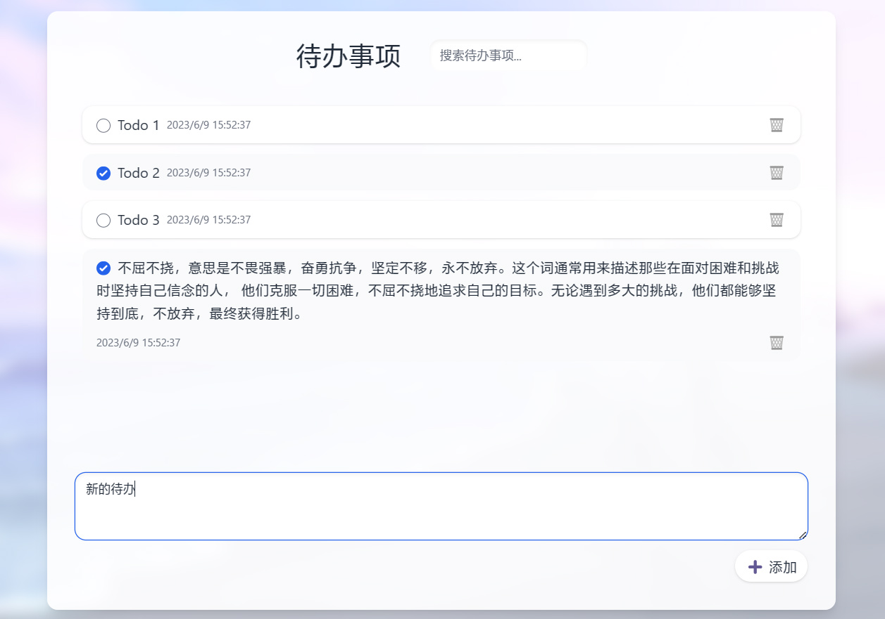
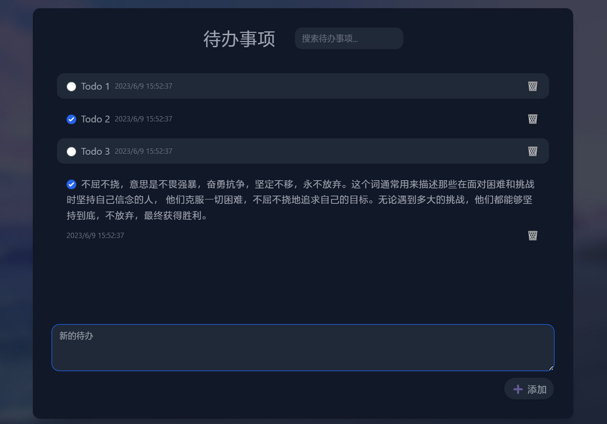

# todo-list-react

使用 React 编写的一个简易待办事项

- 响应式布局
- 夜间模式适配
- 数据存储在浏览器的 LocalStorage

适合初学者学习 Vite、React、Tailwind CSS 等相关内容

## 预览

| 亮色                               | 暗色                             |
|----------------------------------|--------------------------------|
|  |  |

## 推荐的 IDE 配置

[VSCode](https://code.visualstudio.com/) + [Volar](https://marketplace.visualstudio.com/items?itemName=Vue.volar) (and
disable
Vetur) + [TypeScript Vue Plugin (Volar)](https://marketplace.visualstudio.com/items?itemName=Vue.vscode-typescript-vue-plugin).

## 项目部署

### 安装项目依赖

```sh
pnpm install
```

### 开启调试服务器，支持热重载

```sh
pnpm run dev
```

### 编译生产环境资源

```sh
pnpm run build
```
